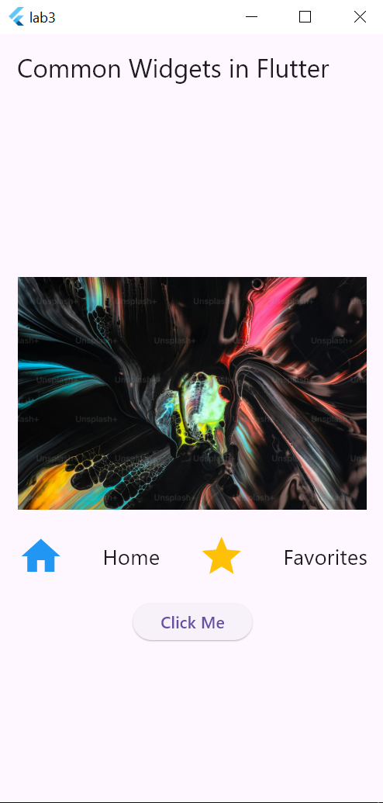
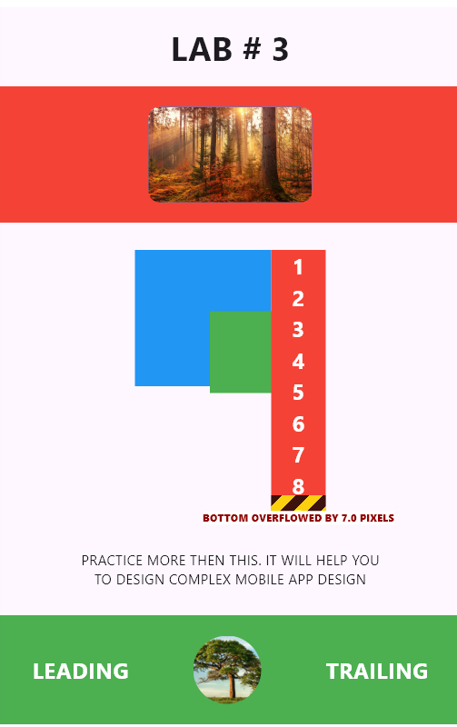

# Lab 3:

This lab was an overiew of the Mobile Application development using dart and flutter framework
. This lab introduces to the basic file structure of the flutter project and an Introduction to the UI components like

- Widgets
- Scaffolds
- Text
- Container
- Rows and columns
- Stack
- Padding
- Icon

etc

## Lab Task 1:

This task was regarding the making of ui components that are mentioned above here is the screenshot for this Task


## Lab Task 2:

This Lab Task was regarding the replication of the give ui design however i tried my level best to do so but I think I fall short for this.



## How to run

- Clone the repository

  ```bash
  git clone https://github.com/ahmedyar7/Mobile-App-Development.git
  ```

- Navigate to Lab-3 folder

```bash
    cd .\Mobile-App-Development\Lab-3
```

- Make sure that you have the requried Dart and Flutter Extenstion installed

- Run Command

```bash
    flutter run
```

## Project Structure:

The main source code of this file is in lib folder

```

├───lib
│----- ahmedyar.dart
│----- main.dart
│----- widget_app.dart

```
